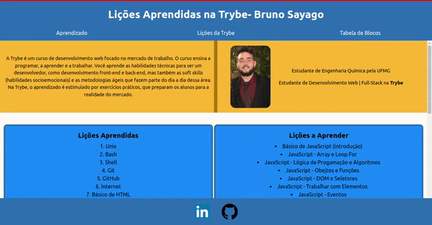

# Projeto 01 - Lessons Learned

Oi. Este foi um dos projetos que eu fiz durante meu curso na Trybe. Confira os detalhes dele abaixo.

## Nome do Projeto
Lessons Learned
## Linguagens e Ferramentas Utilizadas
 - HTML
 - CSS

## Objetivos do Projeto
O objetivo desse projeto foi desenvolver um site que exibisse informações sobre os conteúdos aprendidos até aquele momento do curso. O site foi desenvolvido somente utilizando conceitos básicos de HTML e CSS, como desenvolvimento, posicionamento e customização de elementos.

 
Abaixo está um GIF que apresenta a página desenvolvida.
 

 

## Instruções para visualização
Comando para clonar o projeto:
 - `git clone git@github.com:BrunoSayago/projeto-01-LessonsLearned.git`
 
Se necessário, instalar as dependências:
 - `npm install`
  
O projeto pode ser visto no navegador utilizando-se alguma extensão, como o live server.  
